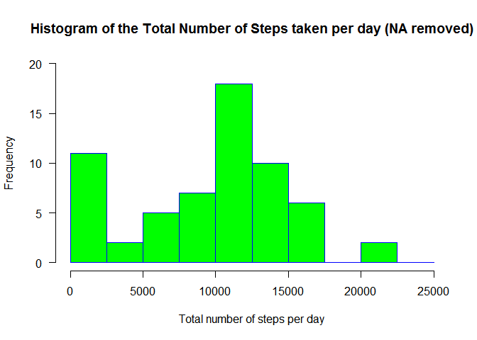
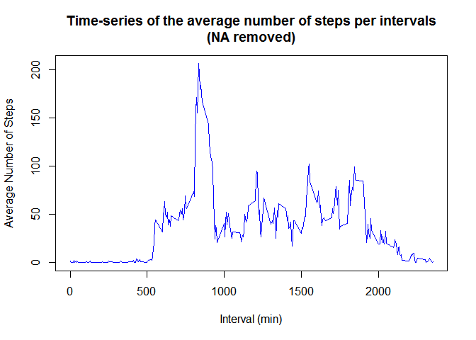
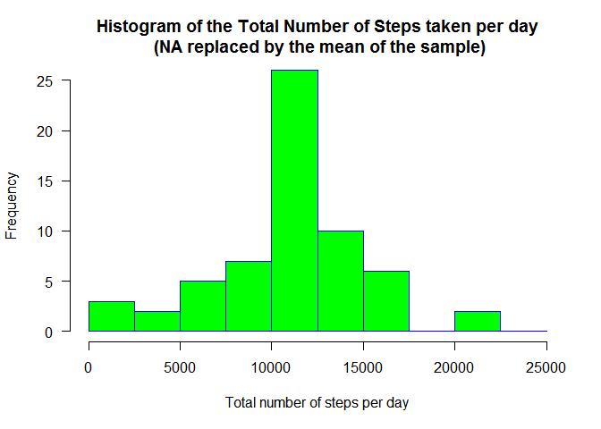
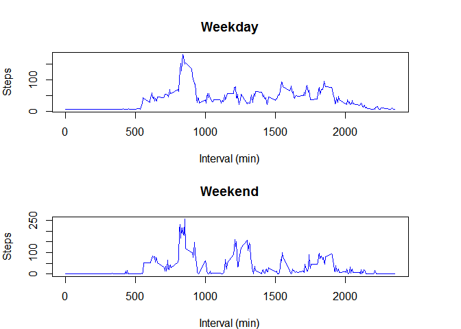

# Reproducible Research: Peer Assessment 1

## Loading and preprocessing the data

```r
setwd("C:/Users/210067772/Coursera/data")
data<- read.csv("activity.csv", colClasses=c("numeric", "character", "numeric"))
```

## What is mean total number of steps taken per day?

Let's ignore the missing values in the dataset.

1. Histogram of the total number of steps taken each day


```r
total.steps <- tapply(data$steps, data$date, FUN=sum, na.rm=TRUE)

hist(total.steps, 
     main="Histogram of the Total Number of Steps taken per day (NA removed)", 
     xlab="Total number of steps per day", 
     ylab="Frequency",
     border="blue", 
     col="green",
     xlim=c(0,25000),
     ylim=c(0, 20),
     las=1, 
     breaks=seq(from=0, to=25000, by=2500)
     )
```

 

2. Calculate and report the mean and median total number of steps taken per day


```r
mean(total.steps)
```

```
## [1] 9354.23
```

```r
median(total.steps)
```

```
## [1] 10395
```

## What is the average daily activity pattern?

1. Make a time series plot (i.e. type = "l") of the 5-minute interval (x-axis) and the average number of steps taken, averaged across all days (y-axis).


```r
av.steps <- aggregate(x = data$steps, by = list(data$interval), FUN = "mean", na.rm=TRUE)
names(av.steps) <- c("Interval", "Average")
plot(av.steps$Interval,
     av.steps$Average, 
     type = "l", 
     col = "blue",
     xlab = "Interval (min)", 
     ylab = "Average Number of Steps",
     main="Time-series of the average number of steps per intervals\n(NA removed)")
```

 

2. Which 5-minute interval, on average across all the days in the dataset, contains the maximum number of steps?


```r
av.steps[which.max(av.steps$Average),] 
```

```
##     Interval  Average
## 104      835 206.1698
```
## Imputing missing values

1. Calculate and report the total number of missing values in the dataset (i.e. the total number of rows with NAs)


```r
count.NA <- sum(is.na(data$steps)) #2304
```
2. Devise a strategy for filling in all of the missing values in the dataset. I decided to use the mean of the sample.


```r
# Find the NA positions
pos.NA <- which(is.na(data$steps))

# create a vector with the mean of the steps, we'll fill the missing values with this vector
fill.NA <- rep(mean(data$steps, na.rm=TRUE), times=length(pos.NA))
```

3. Create a new dataset that is equal to the original dataset but with the missing data filled in.


```r
data[pos.NA, "steps"] <- fill.NA
```

4. Make a histogram of the total number of steps taken each day and calculate and report the mean and median total number of steps taken per day.


```r
new.total.steps <- tapply(data$steps, data$date, FUN=sum, na.rm=TRUE)
hist(new.total.steps, 
     main="Histogram of the Total Number of Steps taken per day\n (NA replaced by the mean of the sample)", 
     xlab="Total number of steps per day", 
     ylab="Frequency",
     border="blue", 
     col="green",
     xlim=c(0,25000),
     ylim=c(0, 25),
     las=1, 
     breaks=seq(from=0, to=25000, by=2500)
)
```

 

```r
mean(new.total.steps) #10766.19
```

```
## [1] 10766.19
```

```r
median(new.total.steps) #10766.19
```

```
## [1] 10766.19
```


## Are there differences in activity patterns between weekdays and weekends?

1. Create a new factor variable in the dataset with two levels - "weekday" and "weekend" indicating whether a given date is a weekday or weekend day.


```r
data$weekday <- weekdays(as.Date(data$date))

daytype <- function(date) {
    if (date %in% c("Saturday", "Sunday")) {
        "weekend"
    } else {
        "weekday"
    }
}
data$daytype <- as.factor(sapply(data$weekday, daytype))
```

2. Make a panel plot containing a time series plot (i.e. type = "l") of the 5-minute interval (x-axis) and the average number of steps taken, averaged across all weekday days or weekend days (y-axis). 


```r
steps.weekday <- aggregate(steps ~ interval, data, subset = data$daytype == "weekday", FUN = mean)
steps.weekend <- aggregate(steps ~ interval, data, subset = data$daytype == "weekend", FUN = mean)

par(mfrow = c(2,1), mar = c(4,4,4,4))

plot(steps.weekday, 
     type = "l", 
     col = "blue",
     xlab = "Interval (min)", 
     ylab = "Steps",
     main="Weekday")

plot(steps.weekend, 
     type = "l", 
     col = "blue",
     xlab = "Interval (min)", 
     ylab = "Steps",
     main="Weekend")
```

 


